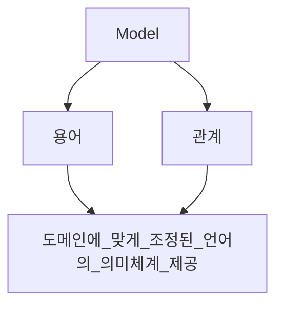
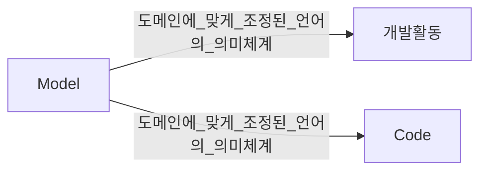
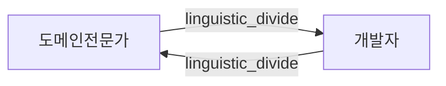
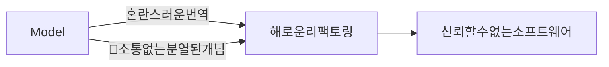
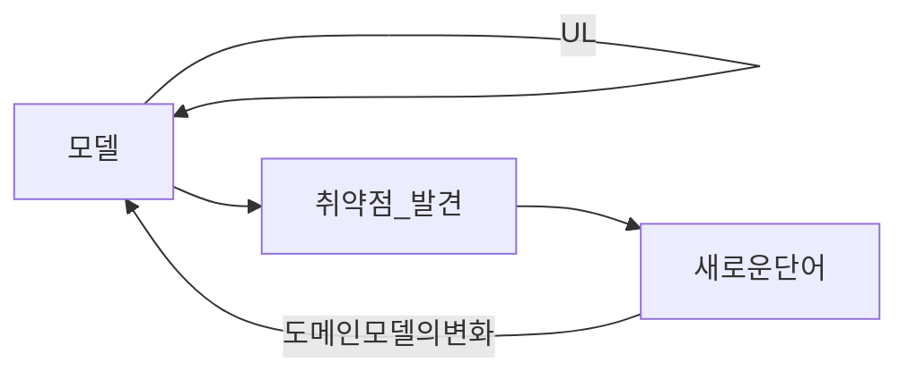

### Model
---

Model : Project 내 구성원의 축적된 개념을 모아 놓은 것이며 용어와 관계로 표현됨.

> [!Note]
> 소통을 어떻게? (α) .

1. UML로 한정되면 안됨,.
2. 모든 의사소통에 스며들어야 함.
3. 코드 자체 가 같는 가독성및 작성자의 의도를 통한 의사소통.
4. 테스트 케이스를 통한 구연하고자 하는 기능적인 의도를 통한 의사소통.
5. .... etc

>[!Note]
>애자일에서 재강조 한다는 약식 다이어그램과 형식에 억매이지 않는 의사소통?

### 용어 - Ubiquitous language
---

도메인 전문가 : 종사하는 도메인의 전문 용어 다양하게 사용
개발자 : 도메인의 전문용어 보단 시스템의 기능적, 서술적 용어 사용.

**언어적 간극** 이 존재하며 그 언어적 간극을 넘어서 도메인 전문가들은 원하는 것을 
**모호** 하게(vaguely) 설명함.

일부만 사용하는 언어는 모두의 필요를 충족하지 못하므로 UL 이 될 수 없음.

도메인이 UL의 근간을 제공하고 소프트웨어 구현에 이르기 까지 연결 할 수 있다.
UL은 모델내 명시적으로 드러나는 규칙을 토론하기 위한 용어가 포함됨.

업무 & 기능 기술시에도 UL 을 사용해야 함.

>[!important]
>1. 모델을 언어의 근간으로 사용할것(다이어그램, 문서 포함)
>2. 대안이 되는 표현을 시도함으로써 어려움을 해소 한뒤 클래스, 메서드, 모듈의 이름을 다시 지으면서 코드를 리팩터링 할 것.
>3. UL의 변화가 곧 모델의 변화.
>4. UL은 단순한 산출물이 아닌 함께 수행하는 모든 부분에서 필요하다.

