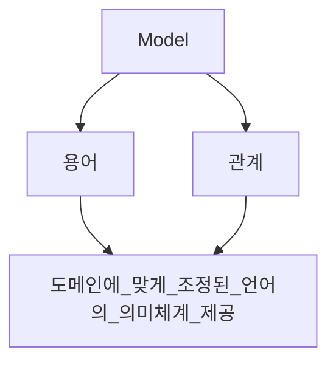
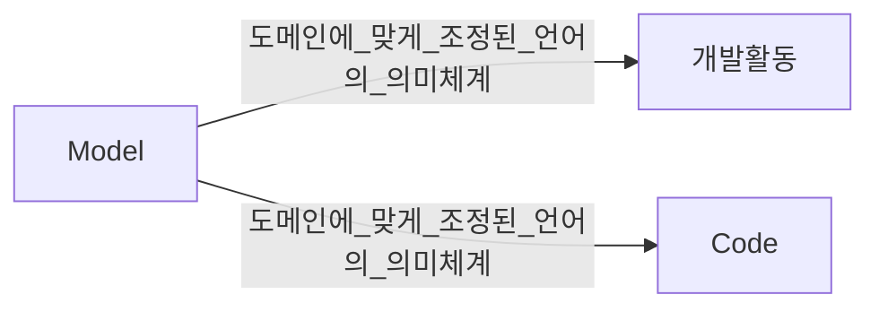
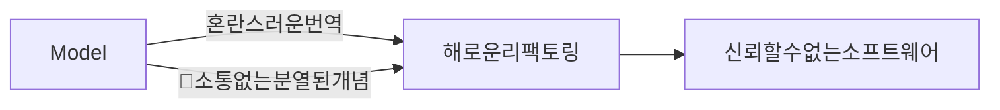
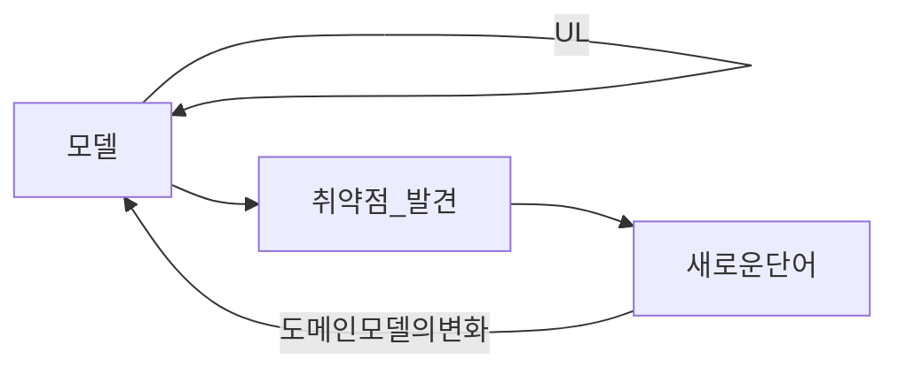
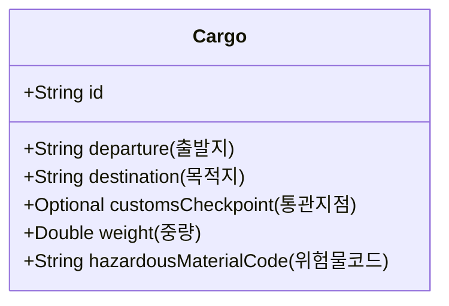
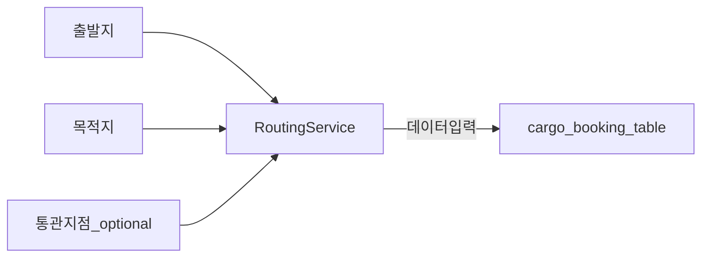
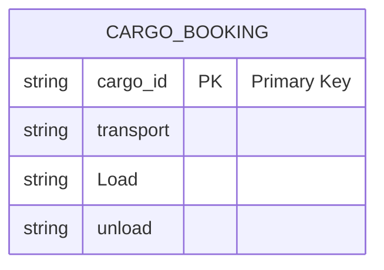
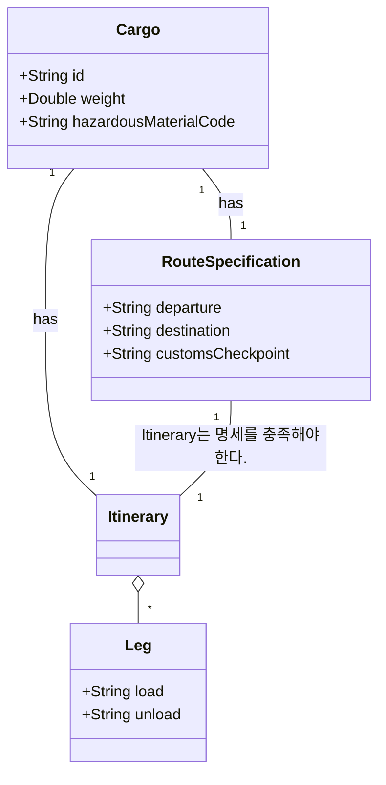
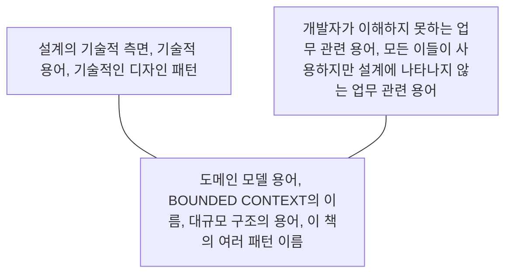

### Model
---

Model : Project 내 구성원의 축적된 개념을 모아 놓은 것이며 용어와 관계로 표현됨.

> [!Note]
> 소통을 어떻게? (α) .

1. UML로 한정되면 안됨,.
2. 모든 의사소통에 스며들어야 함.
3. 코드 자체 가 같는 가독성및 작성자의 의도를 통한 의사소통.
4. 테스트 케이스를 통한 구연하고자 하는 기능적인 의도를 통한 의사소통.
5. .... etc

>[!Note]
>애자일에서 재강조 한다는 약식 다이어그램과 형식에 억매이지 않는 의사소통?

### 용어 - Ubiquitous language
---

도메인 전문가 : 종사하는 도메인의 전문 용어 다양하게 사용
개발자 : 도메인의 전문용어 보단 시스템의 기능적, 서술적 용어 사용.

**언어적 간극** 이 존재하며 그 언어적 간극을 넘어서 도메인 전문가들은 원하는 것을 
**모호** 하게(vaguely) 설명함.

일부만 사용하는 언어는 모두의 필요를 충족하지 못하므로 UL 이 될 수 없음.

도메인이 UL의 근간을 제공하고 소프트웨어 구현에 이르기 까지 연결 할 수 있다.
UL은 모델내 명시적으로 드러나는 규칙을 토론하기 위한 용어가 포함됨.

업무 & 기능 기술시에도 UL 을 사용해야 함.

>[!important]
>1. 모델을 언어의 근간으로 사용할것(다이어그램, 문서 포함)
>2. 대안이 되는 표현을 시도함으로써 어려움을 해소 한뒤 클래스, 메서드, 모듈의 이름을 다시 지으면서 코드를 리팩터링 할 것.
>3. UL의 변화가 곧 모델의 변화.
>4. UL은 단순한 산출물이 아닌 함께 수행하는 모든 부분에서 필요하다.

#### 화물 운송 항로 고안 예제
---
>[!Note]
> 늘어나는 요구사항 앞에 Require) 을 붙여서 표기하겠다.

시나리오 1 도메인에 대한 최소한의 추상화.

Require) 통관지점이 바뀌면 항로 설정을 완전히 변경해야 한다.

1. Cargo_Booking DB에서 통관지점이 변경되야 할 화물 Id를 지닌 행을 전부 제거.
2. 새로운 통관지점 데이터를 다시 재저장.(via Routing service)
3. Cargo에 데이터 유무 Boolean 필드 추가.

Require) 이전에 전혀 통관 지점을 지정하지 않았어도 작업을 해야 함.

출발지, 목적지, 통관지점 변경시 & 처음 입력하는 경우 운송데이터 유무 판단후 초기 디비 값 삭제후 디비 재저장

Require) 반드시 필요한 경우에만 하면 좋겠다.

1. DB 데이터로 통관지점을 찾은 다음에 새로운 통관지점과 비교후 재작업이 필요한 케이스에 한해서만 실행.

Require) 변경의 경우 출발지, 목적지 등 운항일정이 변경되기 때문에 걱정은 하지 않아도 된다.

시나리오 2 : 논의를 돕는 풍성한 도메인 모델.

Require) 통관지점이 바뀌면 항로 설정을 완전히 변경해야 한다.

Route Specification(항로 설정 명세) 에 있는 어떤 속성이라도 변경할 시 이전 ltinerary(운항일정) 을 삭제하고 새로운 Route Specification에 기반을 둔 운항일정을 생성 하겠다.

Require) 이전에 전혀 통관 지점을 지정하지 않았어도 작업을 해야 함.

Route Specification 변경시 ltinerary를 언제나 다시 만듬.

Require) 반드시 필요한 경우에만 하면 좋겠다.

Route Specification에 몇가지 기능 추가.
기능 : Specification이 변경될 때마다 ltinerary가 여전히 Specification를 충족하는지 파악.
충족하지 못할시 재 생성하는 기능.

Require) 출발지와 목적지 걱정은 안해도 된다 그때마다 매번 ltinerary가 바뀐다.

##### 시나리오 1과 2의 를 두고 보는 차이

1. 운항일정(ltinerary)이 객체로 표현되어 Require를 전달하는 사용자와 실제 수행하는 개발자간 논의가 명확해 졌다.
2. 매번 속성과 절차 측면에서 항로 설정 명세를 기술하는 대신 Route Specification객체로 명확하게 표현해서 논의를 이어져 갔다.

### 크게 소리내어 모델링하기
---

> 모델을 정제하는 가장 좋은 방법은 가능한 모델 변형을 구성하는 다양한 요소를 큰 소리로 말하면서 말하기를 통해 살펴 보는 것.
> ex) Routing Service는 Route Specification을 만족하는 ltinerary를 갖는다.

다른 언어적 배경을 지닌 사람이 모인 경우 공통 언어가 없다면 혼성어(pidgin) 을 만들어 낸다

>[!note]
>pidgin (α)
>서로 다른 언어와 문화를 가진 사람들 간의 의사소통을 위해 임시적으로 형성된 언어
>Selca (한 - 영) 정도 일듯.
>크리올 -> 공동체 언어.

이와 같이 도메인 전문가 <-> 개발자 사이에 UL논의시 말로써 언어를 공유할 수 있다.
문법적, 의미적 언어에 재능을 모델을 개발하는데 활용.

>[!note]
>크게 소리내어 모델링하기 를 압축하면
>(pidgin , creole)을 예시로 인간 자체가 갖고있는 언어적 능력을 활용.
>서로다른 문화에서 제 3의 수단으로서의 언어를 활용하여 언어의 구사, 개념의 구체화등을 그리고 그걸 넘은 공동체 공통어로서 활용(creole) 을 예시로
>대화시 모델(도메인에 대해 축적되어 있던 개념)들을 서로서로 논의 하고 대화하면서 위에서 말한 linguistic_divide를 흐리게 하고 모호한 표현에 대해서 서로가 이해하는걸 일치시키고 그사이에서 추상화된 개념들을 객체 설계에 녹이라는 것 같음. (α)

### 한팀 한언어
---

>[!important]
>수준 높은 도메인 전문가도 기술 담당자가 설계한 도메인 모델을 이해하지 못한다면 모델이 뭔가 잘못된 것이다.

개발자 <-> 도메인 전문가 
하나의 언어로 의사소통 한다 :  서로다른 간극이 있는 모호하며 혼재되어있는 각각의 단어를 활용한 의사소통을 하지 않는
객체로 추상화한 단어 or 서로 간극이 있지 않은 도메인 프로세스 내의 업무 용 언어들을 만드는 과정.
등을 포함하는 포괄적인 의사소통으로 보여짐.

위와 같은 정제 되어지는 UL로 요구사항을 재구성 하는 일이 발전과정에 일부가 되어야 함.

아래가 UL

UL이 마련되면 개발자 간 대화, 도메인 전문가 간 논의, 코드 자체에 포함된 표현 모든것이 공유도니 도메인 모델에서 비롯된 동일한 언어를 기반으로 함.

### 문서와 다이어 그램
---

>1. UML은 객체의 개념적 정의를 전달 해 주지 않는다.
>2. 객체 모델 다이어 그램은 지나치게 완전한 동시에 많은 부분이 생략되어 있음.
>3. 객체의 행위와 제약조건은 그리기가 수월하지 않음.
>4. 사실 다이어 그램으로 위 상황을 충족하기엔 해야 할 일이 너무 많은 것도 사실.

>[!important ]
>UML은 모델에 가장 중요한 두가지 측면을 전달할 수 없다.
>1. 모델이 나타내는 개념적 의미.
>2. 모델 객체의 행위.

>[!note]
>[MatLab-Simulink](https://kr.mathworks.com/products/simulink.html) 과 유사한 방식으로 UML 을 Base로 어떤 어플리케이션을 만든다고 가정한다면.
>UML은 당연히 어떤 프로그램 또는 어플리케이션을 바라보는 또하나의 방식으로 전락하고 모델이라는 본연의 의미를 잃어버리고 만다.
>이말을 하는 것은 위와 같이 UML이 지나치게 완전하려는 경향 또는 모델에 집중한 UML은 완전하지 않음이 본래의 의미라는 것을 시사하는 것 같음. (α)

간결한 UML은 의사소통과 설명의 수단이며 브레인 스토밍을 촉진시키는 역할을 한다.
이러한 목적은 다이어 그램이 최소화 되었을때 가장 잘 달성 된다.

1. 설계의 생생한 세부사항은 코드에 담긴다.(텍스트 주석x, 선택적이고 간결함.)
2. 모델은 다이어그램이 아니라는 점을 항상 명심하기.

### 글로 쓴 설계 문서
---

코드 스스로 별도의 설명이 없는 상태를 유지해야 하는 것에는 동의 하나.
설계 문서로서의 코드에는 한계가 존재.
- 코드를 읽는 이는 세부 사항에 압도 될 수 있음.
- 행위 이면에 존재하는 의미는 전달이 힘듬.

> 즉 포괄적인 UML을 활용하는 것과 유사한 문제점이 존재함.

1. 문서는 코드와 말을 보완하는 역할을 하며, 코드가 이미 잘 하고 있는 것을 하려고 해서는 안됨.
   - 코드는 프로그램의 행위를 정확하게 규정한 명세에 해당한다.
2. 문서는 유효한 상태를 유지하고 최신 내용을 담고 있어야 함.
3. UL과 상호작용 해야 함.
4. UL과 UL의 발전이 문서를 유효한 상태로 유지하고 Project 활동과 결부되게 만드는 구심점으로 삼을것.

설계 문서의 가장 큰 가치는 모델의 개념을 설명, 코드의 세부사항을 파악, 특정 모델의 의도된 사용방식에 통찰력을 주는것에 있음.

### 실행 가능한 기반.
---
