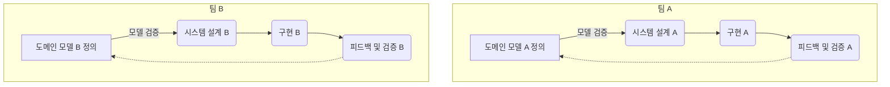

#### 모델과 코드의 대응. (분석모델 예시)
---

>[!warning]
>도메인 모델은 존재하지 않고, 기능만 차례로 구현하기 위해 코드를 작성하는 프로젝트는
>지식 탐구와 의사소통의 이점을 살리지 못함.
>도메인이 복잡해질 수록 그 한계가 드러남.

그렇다면 도메인 모델을 코드에 어떻게 녹일까? 🤔 (α)

#### 모델과 설계의 연결에서 분석모델을 활용 한다면?
---

>[!note]
> **분석 모델** : 소프트웨어적 수행 고려x, 도메인의 개념만을 체계화 하고자 업무 도메인을 분석한 결과물.

**모델과 설계의 연결** 을 분석 모델로 진행하는 것은 비현실적일 가능 성이 높고,
개발자가 설계를 하기위해 새로이 추상화를 할 때 분석 모델에서의 지식의 탐구의 성과가 대부분 사라 진다.

순수하게 이론에만 치우친 분석 모델은 도메인의 이해라는 가장 주된 목표에 미치지도 못하는데
중요한 발견은 실제 설계/구현을 위해 노력하는데에서 나타나기 때문.

결과적으로 순수하게 이론에만 치우친 분석 모델은 코딩이 시작되자마자 폐기되고 대부분의 문제를 다시 검토해야 한다.

>[!important]
>설계의 주된 부분이 도메인 모델과 대응되지 않으면 그 모델은 가치가 없으나,
>모델과 설계 사이의 복잡한 대응은 이해가 힘들고 실제로 설계가 변경되면 유지보수가 불가능해진다.

#### 분석과 설계를 연계를 안한다면? (In Model Driven Design)
---

분석과 설계 양쪽 모두의 목적을 달성하기 위 모델과 설계를 나누는 이분법은 채택하지 않음.
기술적인 쟁점은 배제.

설계상 각 객체는 모델에서 기술한 개념적 역할만 수행하며, 상이한 두 가지 목표를 달성해야 하기 때문에 모델에 부담이 커짐.

### 뭐 분석과 설계 둘 다 어렵고 연계도 어려운데 어쩌라는 건가 🤔
---

>[!important]
>모델 과 설계를 연계하는 것은 실용적임 (모델에 부담이 커지지 않으며 각자의 장점을 취할 수 있기 때문)
>근데 늘 그렇듯 잘 해야되는것.
>모델과 설계를 연계할 때 분석과 설계의 관점에서 모두 효과적인 모델이 필요함.

모델이 구현에 비해 비현실적이거나, 도메인의 핵심 개념을 충실하게 표현하지 않는다면 
새로운 모델을 찾자.

그래야 모델링과 설계 프로세스가 단 하나의 반복 고리를 형성할 수 있음.

뭐 대략 이상적인 반복고리? 
모든 팀 구성원이 UL을 사용하여 소통.

도메인 모델을 설계에 밀접하게 연관시키는 것을 강제하면, 각종 모델 가운데 유용한 것을 선택하는 또하나의 기준이 만들어지고 많은 반복주기와 리팩터링을 거쳐 관련성이 있는 모델이 만들어 진다.

1. 설계시 도메인 모델을 있는 그대로 반영.
2. 모델 꾸준히 재검토 및 수정
3. 분석과 설계를 충분히 만족하는 하나의 모델을 만들려는 노력

##### 아니 그럼 도대체 단하나의 반복고리가 아니면 뭘까? 🤔 (α)
---

위와 같은 연속된 과정이 제대로 이루어지지 않아, 여러 개의 분리된 또는 서로 동기화되지 않는 반복 고리들이 존재하는 상황 인것 같다.

각 과정은 자체적인 도메인 모델, 설계, 구현, 피드백 수집 및 모델 개선 과정을 거치지만, 독립적으로 작업을 진행하여 서로 간의 커뮤니케이션이 부족하고, 도메인 모델이 일관되게 개선되지 않으며 UL을 형성하지 않는 케이스 같음.

#### 실질적으로 모델을 코드에 어떻게 반영 할까? 🤔
---

>[!important]
>1. 모델로 부터 설계와 기본 적인 책임 할당에 사용한 용어를 도출.
>2. 코드 작성시 해당 용어를 사용하면서 코드가 모델을 표현.
>3. 코드의 변경이 곧 모델의 변경으로 이어질수 있도록.
>4. 코드~요구사항분석 개발 노력의 모든 측면에 오로지 하나의 모델만 적용되어야 함.
>  단일 모델은 오류가 일어날 확률을 줄이며 코드 자체도 모델의 전달력을 갖추게 됨.

4번의 경우 단 하나가 아닌 반복고리 케이스를 보면 알수 있듯
독립적인 프로세스간의 모델 불일치가 가져오는 도메인에 대한 이해 및 소통의 저하.
코드간의 일관성 결여, 시스템 전체에서 통일된 접근 방식 결여, 코드 가독성 및 이해도 저하 등등등
코드가 모델의 전달력을 갖추기가 힘들게 된다!.

### 모델링 패러다임과 도구 지원
---
