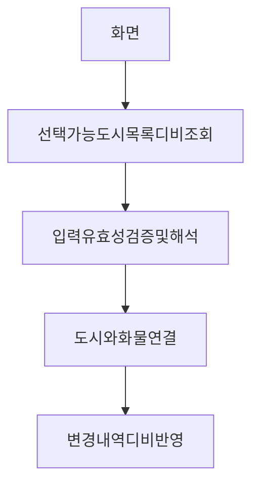

### 서론
---

제시하는 설계 방식은 대부분 책임 주도 설계(responsibility-driven-design)의 원칙을 따른다. \
또한 계약에 의한 설계에 크게 의존하고 있기도 함.

> 시스템에서 도메인과 관련이 적은 기능으로부터 도메인 객체를 분리할 필요가 있으며. \
> 도메인 개념을 다른 소프트웨어 기술에만 관련된 개념과 혼동하거나, 또는 시스템이라는 하나의 큰 덩어리 안에서 도메인을 전혀 바라보지 못하는 문제를 방지할 수 있다.

>[!Note]
>즉 포인트는 도메인 계층의 분리 아래 계층형 아키텍처는 일반적인 예시.
#### 계층형 아키텍처
---

##### 해운 애플리케이션 예시

이중 **일부만 해운 업무와 관련**되어 있음.

소프트웨어 프로그램은 디비연결, 업무로직 수행, 사용자 입력, 네트워크통신등 기능과 관련된 코드양이 많을 수 있음.

OOP 에서는 때때로 UI, DB, 기타 보조적 성격의 코드를 비즈니스 객체 안에 직접 작성하기도함.

>[!important]
>도메인에 관련된 코드가 상당한 양의 도메인과 관련없는 다른 코드를 통해 널리 확산될 경우. \
>도메인에 관련된 코드를 확인하고 추론하기 상당히 힘들어짐. \
>ex) UI 표면적 변경이 업무로직 변경으로 이어짐, 업무 규칙을 변경하기 위해 UI, DB 연결, 다른 요소들을 추적해야 할 수 있음.

출처 : https://fabiofumarola.github.io/nosql/readingMaterial/Evans03.pdf

구체적으로 몇 개의 일반화된 계층이 널리 받아들여지고 있음.

>[!important]
>계층화의 핵심 원칙은 한 계층의 모든 요소는 오직 같은 계층에 존재하는 다른 요소나 계층상 아래에 위치한 요소에만 의존한다는 것. \
>위로 거슬러 올라가는 의사소통은 반드시 간접적인 메커니즘을 거쳐야함. \
>각 계층에서 프로그램의 특정 측면만 전문적으로 다루는데 그 가치가 있으며 더욱 응집력있는 설계가 가능해짐.

| 계층                      | 설명                                                                                                                                                                                                                                                                                                                                                                                                                                |
| ----------------------- | --------------------------------------------------------------------------------------------------------------------------------------------------------------------------------------------------------------------------------------------------------------------------------------------------------------------------------------------------------------------------------------------------------------------------------- |
| 사용자 인터페이스 (또는 표현 계층) | 사용자에게 정보를 보여주고 사용자의 명령을 해석하는 일을 책임진다.  이는 사람 뿐만 아니라 다른 컴퓨터 시스템도 외부 행위자가 되기도 함.                                                                                                                                                                                                                                                                                                                                                 |
| 응용 계층                   | 소프트웨어가 수행할 작업을 정의하며, 표현력 있는 도메인 객체가 문제를 해결하도록 함. 이 계층은 업무상 중요하거나 다른 시스템과의 상호작용을 필요로 하는 것들. 이 계층은 얇게 유지된다 여기에 업무 규칙이나 지식은 포함하지 않으며, 오직 작업을 조정하고 아래에 위치한 계층에 포함된 도메인 객체의 협력자에게 작업을 위임 한다. 응용 계층에는 **업무 상황을 반영하는 상태가 없지만**,  사용자나 프로그램의 작업에 대한 진행상황을 반영하는 상태를 가질 수는 있다. |
| 도메인 계층                  | 업무 개념과 업무 상황에 관한 정보, 업무 규칙을 표현하는 일을 책임집니다.  이 계층은 업무 상황을 반영하는 상태를 제어하고 사용하며, 상태 저장과 관련된 기술적 세부사항은 인프라스트럭처 계층에 위임합니다.  업무용 소프트웨어의 핵심.                                                                                                                                                                                                                              |
| 인프라스트럭처 계층              | 상위 계층을 지원하는 일반화된 기술적 기능을 제공합니다.  이러한 기능에는 애플리케이션에 대한 메시지 전송, 도메인 영속화, 비주얼 위젯 그리기 등이 포함됩니다.  또한 인프라스트럭처 계층은 아키텍처 프레임워크를 통해 네 가지 계층 간의 상호작용 패턴을 지원할 수 있습니다.                                                                                                                                                                                                                                                                   |

1. 복잡한 프로그램을 여러개의 계층으로 나눌것
2. 아래에 위치한 계층에만 의존하는 각 계층에서 설계를 발전
3. 상위 계층과 결합도를 느슨하게 유지.
4. 도메인 모델과 관련 된 코드는 한 계층에 모으고 나머지는 격리.

>[!important]
>MDD를 가능하게 하는 것은 결정적으로 도메인 계층을 분리하는 것에 있다.
>도메인 모델을 표현하는 것에만 집중 할 수 있으며 모델은 변경되는 과정을 통해 풍부하고 명확해짐.

#### 이점 두가지

> 1. 격리된 각 계층이 각자 다른 속도로 발전해서 각기 다른 요구에 대처하기 때문에 유지 비용이 적어짐
> 왜 그럴까? 🤔 (α)

   ex) 도메인 계층에는 KYC 핵심 비즈니스 로직과 규칙이 포함되어 있어 안정성과 일관성을 유지해야 할 필요가 있음. \
   반면 사용자 인터페이스는 UI를 개선하거나 새로운 사용자 요구사항을 적용하기 위해 자주 업데이트가 필요할 수 있음. \
   인프라 계층은 쿼리 튜닝, 데이터 베이스 테이블 변경, indexing or NoSQL DB 활용을 고려할 수 있음.
   
계층을 분리함으로써, 한 계층에서 변경이 일어날 때 다른 계층에 변경을 요구하지 않아도 되므로 의존성을 줄이고 유지 보수 및 테스트를 간소화할 수 있음.

>2. 분산된 시스템에 배포할 때도 이러한 분리가 도움되는데, 통신상의 부하를 최소화하고 성능을 개선하고자 각기 다른 서버나 클라이언트에 각 계층을 유연하게 둘수 있기 때문이다. 왜 그럴까? 🤔 (α)

1. **통신 최적화**: 각 계층이 최적의 위치에 배치 되어 필요한 리소스에 빠르게 접근할 수 있음. 
   이는 네트워크 latency 를 줄이고, 데이터 처리 속도를 향상시킬 수 있음.
   ex) 사용자 인터페이스 쪽은 image 관련해서 s3 & cloudfront를 활용해서 네트워크 latency를 줄일 수 있음.
2. **부하 분산**: 각 계층이 별도의 서버에서 운영되므로, 한 계층에서 발생하는 부하가 다른 계층으로 전파되지 않을 수 있음. \
   이는 시스템 전체의 안정성과 응답성을 향상시킴. \
   ex) 그걸 넘어서 서킷 & 쿠버 오토스케일링 
3. **자원 효율성 증가**: 서버와 서비스를 계층에 따라 적절히 할당함으로써 자원 사용을 최적화하고, 필요에 따라 독립적으로 확장 또는 축소할 수 있음.
    ex) ec2를 예시로 들면 계산 집약적인 응용 계층(Spring Boot 애플리케이션)은 CPU 성능이 뛰어난 C5 인스턴스에 배치하고, I/O가 많은 데이터베이스 계층은 I/O 최적화된 R5 인스턴스에 배치

>[!Note]
>위 와 같이 생각을 정리하고 Martin Fowler는 어떻게 생각했을까 확인 해 보았다. 🤔 (α) \
>[Martin Fowler : Analysis Patterns (1996) - LayerdArchitecture 관련 이점 정리 ](https://github.com/christopher3810/DomainDrivenDesign/blob/master/DDD/Martin%20Fowler%20Analysis%20Patterns%20Reusable%20Object%20Models%201996%20Layered%20Architecture%20for%20Information%20Systems.md) \
>[Martin fowler : Patterns-of-distributed-systems (2002) 카탈로그 링크](https://martinfowler.com/articles/patterns-of-distributed-systems/) 

>[!warning]
>분산 시스템을 기존에 사용하고 있는 경우에 대한 통신 상의 부하 감소 등의 성능적 이점임. \
>기존 서비스가 트래픽이 적거나 실제로 분산서비스로 활용될 인프라 비용대비 실제 사용될 서비스 규모가 작은 경우 분산서비스는 통신비용 증가로 이어 질 수 있음 이부분은 모놀리식 시스템과 분산 시스템의 구조적 변경에 시점에 대한 문제이고 위 부분은 분산 시스템을 잘 가용하고 있다는 전제 하에 장점임. (α)

### 온라인 뱅킹 기능 계층 분리 예제
---

사용자가 두 계좌번호와 일정 금액을 입력 or 선택시 이체가 시작되는 자금 이체 기능.

응용 계층이 아닌 도메인 계층에서 주요 업무 규칙을 책임. \
모든 대변에는 그것과 일치하는 차변이 있다.

### 계층간 관계 설정
---

분리의 이점을 잃지 않으면서 각 계층을 서로 연결하는 것이야 말로 각종 패턴이 존재하는 이유.

>[!important]
>각 계층은 설계 의존성을 오직 한 방향으로만 둬서 느슨하게 결합된다. \
>상위 계층은 하위 계층의 공개 인터페이스를 호출하고 하위 계층에 대한 참조를 가지며 하위 계층의 구성요소를 직접적으로 사용하거나 조작할 수 있다. \
>그러나 하위 수준의 객체가 상위 수준의 객체와 소통해야 할 경우에는 callback, observer 패턴 처럼 계층 간에 관계를 맺어주는 아키텍쳐 패턴을 활용할 수 있다.

인프라스트럭처 계층에서는 도메인 계층에서 어떤 활동이 일어나게 하지 않는다. \
도메인 계층 아래에 있으므로 도메인에 대한 구체적 지식을 가져선 안된다. \
기술 적 기능은 대개 Service 로 제공된다.

>[!important]
>이와 같은 분리의 주된 이점은 메시지를 언제 보내는지는 알아도 어떻게 보내는지는 알 필요가 없어진 다는 것이다.

응용 계층과 도메인 계층에서는 인프라스트럭처 계층에서 제공하는 서비스를 요청하며 서비스의 범위와 인터페이스를 적절하게 선정하고 설계하면 **호출하는 쪽은 서비스인터페이스에서 캡슐화 하는 정교한 행위를 바탕으로 느슨하게 결합되고 단순해 질 수 있다.**

>[!Note]
>When infrastructure is provided in the form of SERVICES called on through interfaces, it is fairly intuitive how the layering works and how to keep the layers loosely coupled
> 
> (<->)
>
>But some technical problems call for more intrusive forms of infrastructure.
>
>하지만 몇몇의 기술적인 문제사항들은 보다 intrusive 형태의 인프라스트럭를 필요로 한다.
>
>intrusive 🤔 (α)
>
>"non-intrusive" means that your application code doesn't need to depend on the Spring framework directly. _Anything_ that can inject the appropriate dependencies will (theoretically) work just as well.

특정 프레임워크에서는 예를들어 프레임워크 클래스의 하위 클래스가 되야 하거나, 일정한 메서드명을 지정해야 하는 등의 특수한 방식으로 다른 계층이 구현되기를 요구 할 수도 있다.

바람직한 프레임워크라면 도메인 개발자가 모델을 표현하는 것에만 집중하게 해서 복잡한 기술적 난제를 해결한다. \
프레임워크의 목적은 도메인 모델을 표현하고 해당 도메인 모델을 이용해 중요한 문제를 해결하는 구현을 만드는 데에 있다.

필요하다면 선택적으로 여러 프레임워크를 적용하여 극복할 수도 있고 프레임워크의 유용한 기능만 분별력 있게 적용한다면 구현과 프레임워크간의 결합이 줄어들어 차후 설계 의사 결정을 유연하게 내릴 수 있다.

프레임워크의 발전과 그로 인해 개발자들은 핵심적인 업무 관련 문제만 모델링하는데 점점 시간을 보내게 되고 생산성과 품질이 향상될 것이나 기술적인 해결책에 대한 열정만큼은 사수해야 한다. \
정교한 프레임워크는 애플리케이션 개발자들을 속박할 수 도 있다.

>[!Note] 
> (α)
>프레임워크에 의존하기만 하면 개발자들은 새로운 기술을 배우고 탐구하는 동기를 잃을 수 있음. \
>지속적인 학습과 성장, 변화하는 기술 환경에 적응은 당연히 필요함. \
>정확히 말하면 정교한 프레임워크에 의존하는 행위에 대한 경계가 필요하며, 프레임워크는 보조적인 수단에 불과.

### 도메인 계층은 모델이 살아가는 곳
---

Layered Architecture는 대부분 계층화 계획하에 사용되며 계층화의 혜택을 얻을 수 있다.

그러나 도메인 주도 설계 에서는 오직 한 가지 특정한 계층만이 존재할 것을 요구.

도메인 모델은 일련의 개념을 모아놓은 것이며, 도메인 계층은 그러한 모델과 설계 요소에 직접적으로 관계돼 있는 모든 것들을 명시한 것.

>[!important]
>도메인 로직이 프로그램상의 다른 관심사와 엮여 있다면 수월하지 않다. \
>따라서 도메인 주도 설계의 전제 조건은 도메인 구현을 격리시키는 것이다.

#### Smart UI 안티 패턴
---

>지금 까지는 널리 알려진 Layerd Architecture 패턴을 요약.

>Smart UI - 훨씬 덜 복잡한 설계 접근법, DDD와 상호배타적 관계, 그렇기에 안티패턴. \
>그러나 특정상황에 적용할수 있는지는 확인해야 함.

#### 예시
---

입력, 표시 방식에 영향을 받고 업무 규칙이 거의 없는 경우. \
직원들은 고도의 객체 모델링을 수행하는 인원이 아님.

Layerd Architecture을 적용하기 까지의 러닝 커브 존재. \
기간 안의 과업 완수를 하기도 전 프로젝트 취소 가능성.

기간이 충분히 주어지더라도 전문가의 도움 없이 성숙하지 않은 결과물이 나올가능성 농후.

>[!Note]
>그럼 어떻게 할까? \
>모든 업무 로직 사용자 인터페이스에 때려넣어라! \
>애플리케이션을 작은 기능으로 잘게 나누고 각기 분리된 사용자 인터페이스로 구현해서 업무 규칙을 분리된 사용자 인터페이스에 넣어라. \
>RDB를 데이터 공유 저장소로 쓰고, 이용 가능한 최대한 자동화된 UI 구축도구와 시각적인 프로그래밍 도구 사용.
#### Smart UI 장점
---

단순하면 생산성 높고 효과 즉각적. \
러닝커브 적고 업무 진행 가능. \
프로토타입 배포후 변경후 문제해결방식으로 간단하게 처리 가능. \
유지보수시 변경효과가 특정 UI에 국한되기 때문에 처리가 쉬움.

#### Smart UI 단점
---

디비 말고 애플리케이션 통합이 쉽지 않음. \
추상화를 그닥 활용 안함. \
추상화의 부재로 리팩터링의 여지가 제한되고 프로토타입 작성과 반복주기가 태생적 한계에 도달. \
복잡성에 압도되어 성장 경로가 부가적인 단순 응용으로만 진행. 

#### 아니 이걸 왜 알아야될까
---

>[!Note]
>도메인에서 애플리케이션을 왜 분리하는지, 언제 그렇게 분리하고 싶지 않은지를 이해하는데 도움을 줌.

SMART UI 와 Layerd Architecture 중간도 존재 \
MartinFowler 2003 - Transaction Script \
위는 애플리케이션과 UI의 분리는 존재하나 객체에 모델을 제공해주진 않는다.

>[!Note]
>DDD 베이스의 Layerd Architecture로 넘어가기 위해서 알아야할 주요 개념은. \
>아키텍처에서 응집력 있는 도메인 설계가 시스템의 다른 부분과 느슨하게 결합될 수 있게 도메인 관련 코드를 격리한다면 DDD를 지원할 수 있을 것.(아마~)

### 다른 종류의 격리
---
뒤에서 BOUNDED CONTEXT, ANTICORRUPTION LAYER 와 같은 패턴 소개
