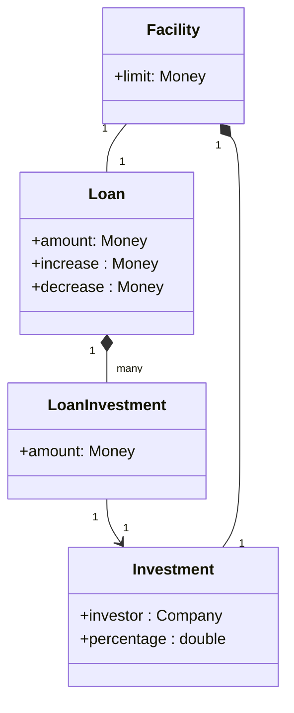
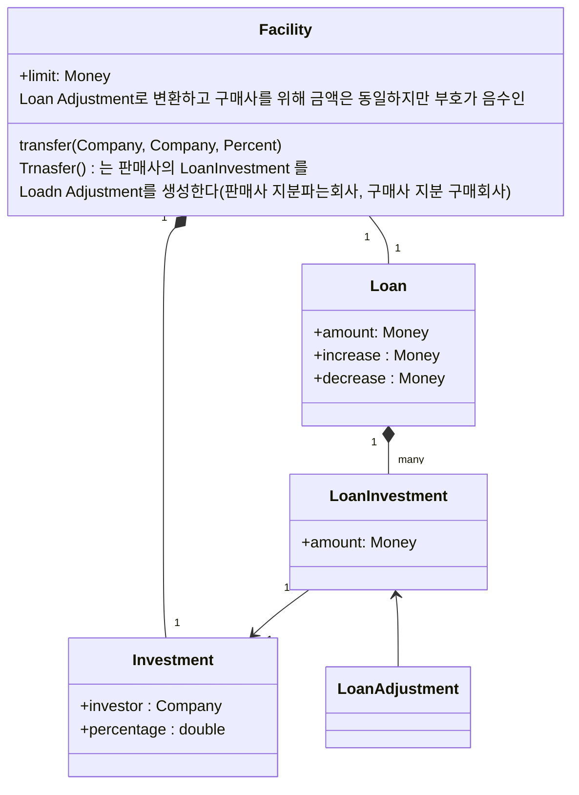
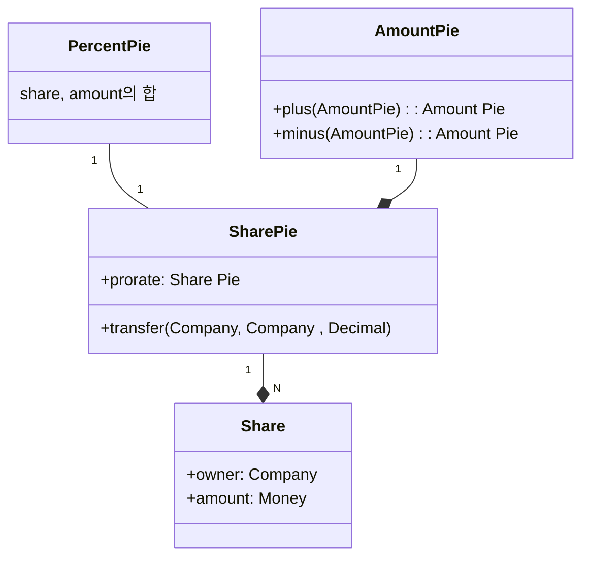
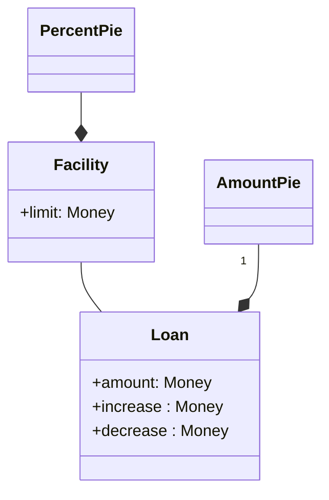

### 
>개발자는 개별적인 코드 개선과 모델의 개선 작업을 토대로 좀더 명확한 시각을 갖게 된다
>이러한 명확성을 바탕으로 통찰력을 도약시킬 수 있는 잠재적인 가능성이 열린다
>맹렬하게 이뤄지는 변경은 모델을 사용자의 현실과 우선순위에 부합하게 만든다
>복잡성이 사라지는 바로 그 때 갑자기 모델의 융통성과 표현력이 높아진다
>이런 부류의 도약은 기법이 아니다
>그것은 사건이다
>중요한 문제는 무슨 일이 일어나고 있는지 인식하고 이를 어떻게 처리할지 결정하는 것이다

Facility에 포함된 지분은 단지 특정 대출자금을
인출할 때의 가이드라인에 불과하다는 사실을 뒤늦게야 이해했다는 것이다
차용인이 대출금을 요청하면 채권은행단의 대표는 모든 대출사에게 각 대출사가 보유한 지분만큼의 대출금을 제공해줄 것을 요청한다

Loan Adjustment 즉 대출 조정을 추가해서 회사마다 지분에 따라 금액 제공액이 다른것을 해결함.

>[!info]
>하지만 점점 복잡해지는 알고리즘 탓에 미묘한 반올림 문제가 존재함.

Facility와 Loan의 지분을 밀접하게 결부 시켰음.

Loan과 Facility의 지분은 상호독립적으로 변경 가능 

ex) Facility 가 1억을 산정하면 회사별 loan은 그안에서 독립적으로 움직일 수 있음.

첫째로 “투자(Investment)”와 “대출 투자(LoanInvestment)”는 일반적이면서도 기본적인 개념인 
지분(share)의 두 가지 특수한 경우에 불과하다

퍼실리티의 지분,대출의 지분,상환액 분배의 지분 등등 모든 곳에지분이 존재한다
지분이란 분배할 수 있는 값을 의미한다

간결하고 쉽게 조합할 수 있는 지분 계산을 도입하는게 가능해짐.
Loan Share가 Facility Share에 대한 비율에 얽매이지 않게 만들어짐.
Loan의 아iare Pie를 직접 조정할 수 있으므로 더는 Load Adjustment가 필요하지 않게 됐고 특별한 경우를 처리하는 상당한 양의 로직을 제거할 수 있음.