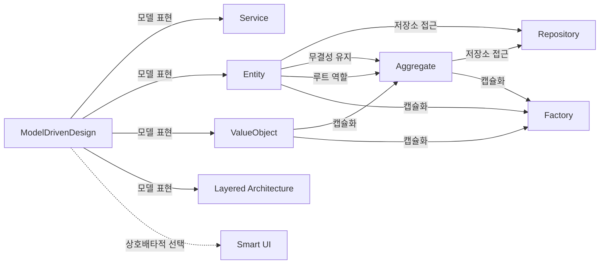

모델의 개별 요소를 실제로 설계하고 구현하는 일은 비교적 체계적으로 이루어 질 수 있음.
도메인 설계 외에 수많은 관심사로 부터 도메인 설계를 격리 하면 모델과 설계의 관계가 훨씬 분명해질 것.

ModelDrivenDesign 은 Service를 모델을 표현하는데 활용
ModelDrivenDesign 은 Entity를 모델을 표현하는데 활용
ModelDrivenDesign 은 ValueObject를 모델을 표현하는데 활용
ModelDrivenDesign 은 Layered Architecture를 모델을 표현하는데 활용
ModelDrivenDesign 은 Smart Ui와 상호배타적인 선택

Entity는 Repository를 접근하는데 활용
Entity는 Aggregate를 무결성을 유지하는데 활용
Entity는 Aggregate를 루트 역할을 함
Entity는 Factory를 캡슐화하는데 활용

ValueObject는 Aggregate를 캡슐화하는데 활용
ValueObject는 Factory를 캡슐화 하는데 활용

Aggregate는 Repository를 접근하는 데 활용
Aggregate는 Factory를 캡슐화 하는데 활용