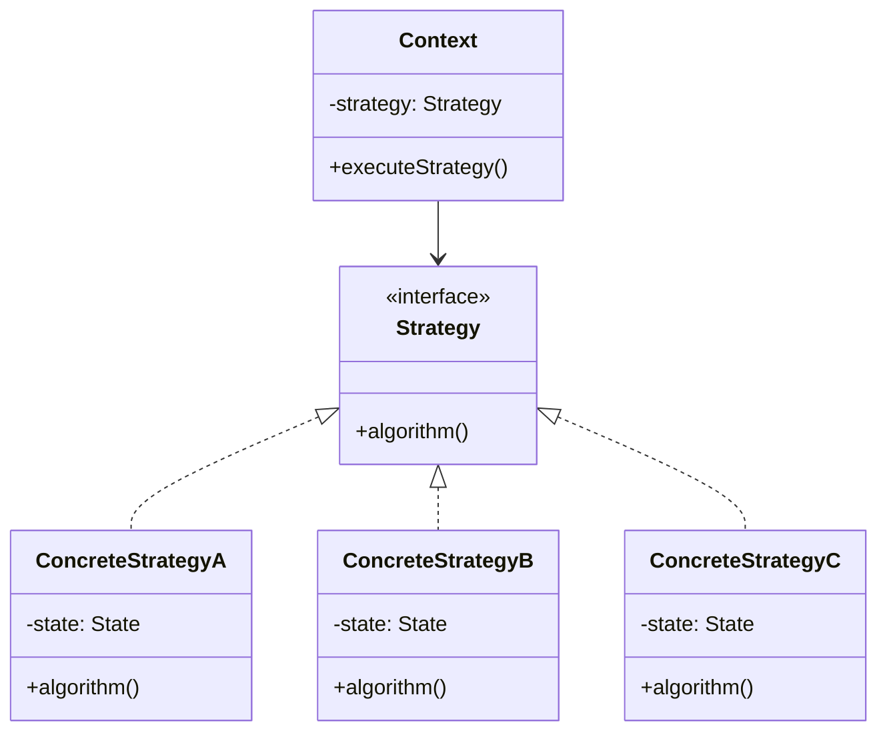
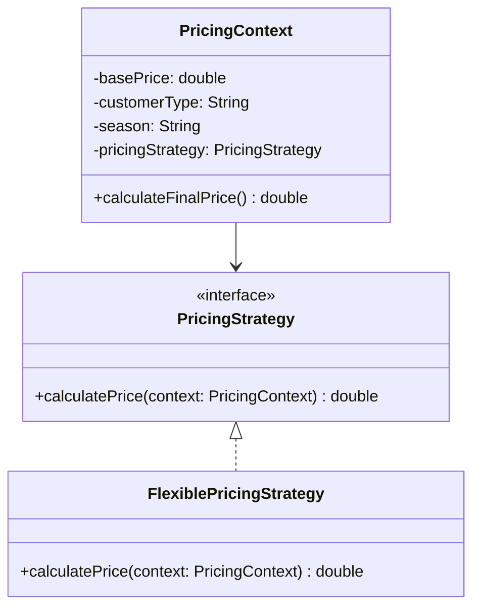

### Startegy

>디자인 패턴에 소개된 패턴 가운데 일부 패턴만을 도메인 패턴으로 사용할 수 있다. \
>이를 위해서는 디자인 패턴에서 강조하는 사항을 도메인 패턴에 맞게 적절하게 수정해야 한다.

>도메인 주도 설계에서 디자인 패턴을 활용 하려면 동시에 두 가지 수준에서 패턴을 바라봐야만 한다. \
>한 가지 수준은 코드 내에 포함된 기술적인 측면을 다루는 디자인 패턴이다.\
>다른 수준은 모델 내에 포함된 개념 패턴이다.

>도메인 모델에는 기술적인 이유로 필요한 것이 아니라 실제적으로 문제 도메인 관점에서 의미 있는 프로세스가 존재한다. \
>여러 종류의 프로세스 중 하나를 선택해야 할 경우 적절한 프로세스를 선택하는 데 따르는 복잡성과 다수의 프로세스가 존재한다는 사실 자체에 내포된 복잡성이 결합되어 결국 감당하기 어려운 지경에 이르고 만다.

>프로세스에서 변화하는 부분을 별도의 전략(strategy) 객체로 분리해서 모델에 표현하라. \
>프로세스의 규칙과 프로세스를 제어하는 행위를 서로 분리하라. \
>STRATEGY 디자인 패턴에 따라 규칙이나 대체 가능한 프로세스를 구현하라. \
>다양한 방식으로 변형된 전략 객체는 프로세스의 서로 다른 처리 방식을 표현한다.\

>STRATEGY를 디자인 패턴으로 바라보는 전통적인 관점에서는 각기 다른 알고리즘 간에 상호 대체할 수 있는 능력에 중점을 두는 반면, \
>도메인 패턴으로 사용하는 관점에서는 프로세스 또는 정책적인 규칙과 같은 하나의 개념을 표현하는 능력에 중점을 둔다.

#### 전통적인 디자인 패턴으로서의 STRATEGY

1. STRATEGY 패턴은 주로 알고리즘의 교체 가능성에 초점을 맞춤.
2. 목적: 런타임에 알고리즘을 쉽게 바꿀 수 있도록 하는 것, 주로 기술적인 관점에서 코드의 유연성을 높이는 데 중점.

#### 도메인 패턴으로서의 STRATEGY

1. 이 관점에서는 STRATEGY를 비즈니스 로직이나 도메인 개념을 표현하는 수단으로 봄
2. 목적: 비즈니스 프로세스, 정책, 규칙 등을 명확하게 모델링하는 것.
    - 예를 들어, 다양한 할인 정책이나 가격 책정 전략을 모델링하는 데 사용할 수 있음.
    - 이는 도메인 전문가와의 의사소통을 개선하고 비즈니스 로직을 더 명확하게 표현하는 데 중점을 둠.


>STRATEGY 사용할 경우 애플리케이션 내의 객체 수가 늘어날 수 있다는 점이다. \
>객체 수가 문제가 된다면 컨텍스트를 공유하는 상태 없는 객체로 STRATEGY를 구현해서 부담을 줄일 수 있다.

일반적인 객체 수가 늘어나는 케이스



1. 각 ConcreteStrategy 클래스가 자체적인 상태(state)를 가짐.
2. Context 객체마다 새로운 ConcreteStrategy 인스턴스가 필요.
3. 다양한 상황에 대응하기 위해 여러 ConcreteStrategy 인스턴스가 생성.

상태가 없어서 부담을 줄이는 케이스.



```java
// Strategy 인터페이스
interface PricingStrategy {
    double calculatePrice(PricingContext context);
}

// 구체적인 전략 클래스 (하나만 존재)
class FlexiblePricingStrategy implements PricingStrategy {
    @Override
    public double calculatePrice(PricingContext context) {
        double basePrice = context.getBasePrice();
        String customerType = context.getCustomerType();
        String season = context.getSeason();

        double discount = 0;
        if (customerType.equals("PREMIUM")) {
            discount += 0.1;
        }
        if (season.equals("WINTER")) {
            discount += 0.05;
        }

        return basePrice * (1 - discount);
    }
}

// Context 클래스
class PricingContext {
    private double basePrice;
    private String customerType;
    private String season;
    private PricingStrategy pricingStrategy;

    public PricingContext(double basePrice, String customerType, String season, PricingStrategy pricingStrategy) {
        this.basePrice = basePrice;
        this.customerType = customerType;
        this.season = season;
        this.pricingStrategy = pricingStrategy;
    }

    public double getBasePrice() { return basePrice; }
    public String getCustomerType() { return customerType; }
    public String getSeason() { return season; }

    public double calculateFinalPrice() {
        return pricingStrategy.calculatePrice(this);
    }
}

// 사용 예
public class Main {
    public static void main(String[] args) {
        PricingStrategy sharedStrategy = new FlexiblePricingStrategy();

        PricingContext context1 = new PricingContext(100, "REGULAR", "SUMMER", sharedStrategy);
        PricingContext context2 = new PricingContext(100, "PREMIUM", "WINTER", sharedStrategy);

        System.out.println("Price 1: " + context1.calculateFinalPrice());
        System.out.println("Price 2: " + context2.calculateFinalPrice());
    }
}
```

기존 방식

```java
class PremiumPricingStrategy implements PricingStrategy { ... }
class RegularPricingStrategy implements PricingStrategy { ... }
class SeasonalPricingStrategy implements PricingStrategy { ... }
```

현재 방식

```java
interface PricingStrategy {
    double calculatePrice(PricingContext context);
}

class FlexiblePricingStrategy implements PricingStrategy {
    @Override
    public double calculatePrice(PricingContext context) {
        double basePrice = context.getBasePrice();
        double discount = calculateDiscount(context);
        return basePrice * (1 - discount);
    }

    private double calculateDiscount(PricingContext context) {
        double discount = 0;
        discount += getCustomerTypeDiscount(context.getCustomerType());
        discount += getSeasonalDiscount(context.getSeason());
        // 여기에 더 많은 할인 규칙을 추가.
        return discount;
    }

    private double getCustomerTypeDiscount(String customerType) {
        // 고객 유형별 할인 로직
        return customerType.equals("PREMIUM") ? 0.1 : 0;
    }

    private double getSeasonalDiscount(String season) {
        // 계절별 할인 로직
        return season.equals("WINTER") ? 0.05 : 0;
    }
}
```

실제 구현될 객체 갯수 감소 가능.

이 접근방식의 핵심은 완전히 다른 가격 책정 로직이 필요한 경우에만 새로운 전략 클래스를 만드는 것. 

대부분의 경우, 기존의 
`FlexiblePricingStrategy` 내에서 새로운 메서드나 조건을 추가하여 확장.

이라고 이해해봤다.

### Compoisit
---

#### 도메인 모델에서의 추상 타입 정의
도메인에서 계층 구조를 가진 개념을 모델링할 때, 이 구조의 모든 요소를 포괄하는 추상 타입을 정의. 
예를 들어, 조직 구조를 모델링한다면 '조직 구성원'이라는 추상 타입을 만들 수 있음.

#### 집계 정보의 도메인적 의미
도메인 패턴으로서 COMPOSITE을 적용할 때, 집계 정보는 단순한 기술적 집계가 아니라 도메인에서 의미 있는 정보여야 함. \
예를 들어, 조직 구조에서 '총 인원수'나 '총 예산' 같은 정보를 제공할 수 있음.

#### 단말 노드의 도메인 특성
도메인 모델에서 단말 노드는 해당 도메인의 기본 단위를 나타냄. \ 
예를 들어, 조직 구조에서는 개별 직원이 될 수 있음. \ 
이들은 자신의 고유한 도메인 특성을 가지게 됨.

#### 도메인 로직의 일관성
클라이언트가 컨테이너와 단말 노드를 구분하지 않고 사용한다는 것은, 도메인 로직이 계층 구조의 모든 레벨에서 일관되게 적용됨을 의미. \ 
이는 도메인 규칙의 일관성을 보장.

#### 도메인 개념의 구체화
COMPOSITE 패턴을 도메인 패턴으로 적용할 때, 단순히 구조를 모델링하는 것을 넘어 도메인 특유의 연산과 행위를 정의하는 것이 중요. \ 
이는 도메인 개념을 더 풍부하게 표현 가능하게 함. \

#### 도메인 지식의 캡슐화
복잡한 계층 구조와 관련된 도메인 지식을 패턴 내에 캡슐화할 수 있음. \

### Fly Weight
---

>이것은 VALUE OBJECT에 적용할 수 있는 구현 선택사항이지만 ENTITY에는 적용할 수 없다.

FLYWEIGHT 패턴은 주로 성능 최적화를 위한 기술적인 패턴입니다. \
반면, 도메인 패턴은 비즈니스 개념과 규칙을 모델링하는 데 사용.

