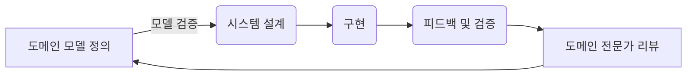
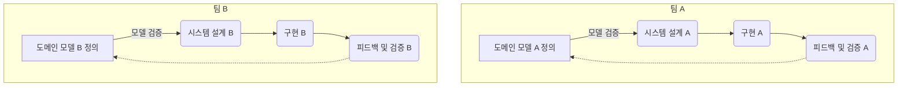
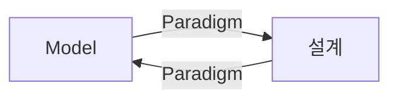
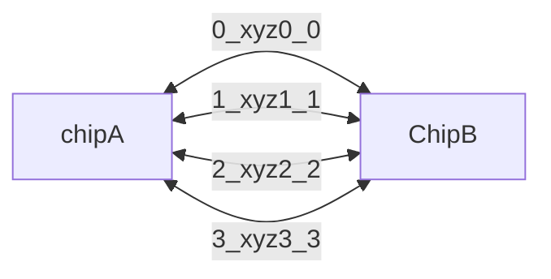
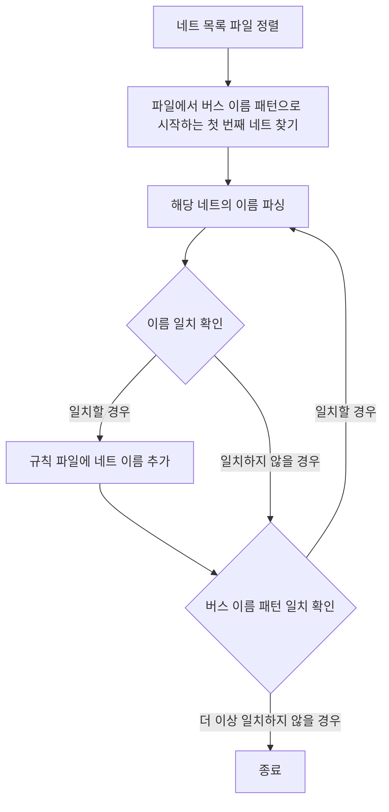
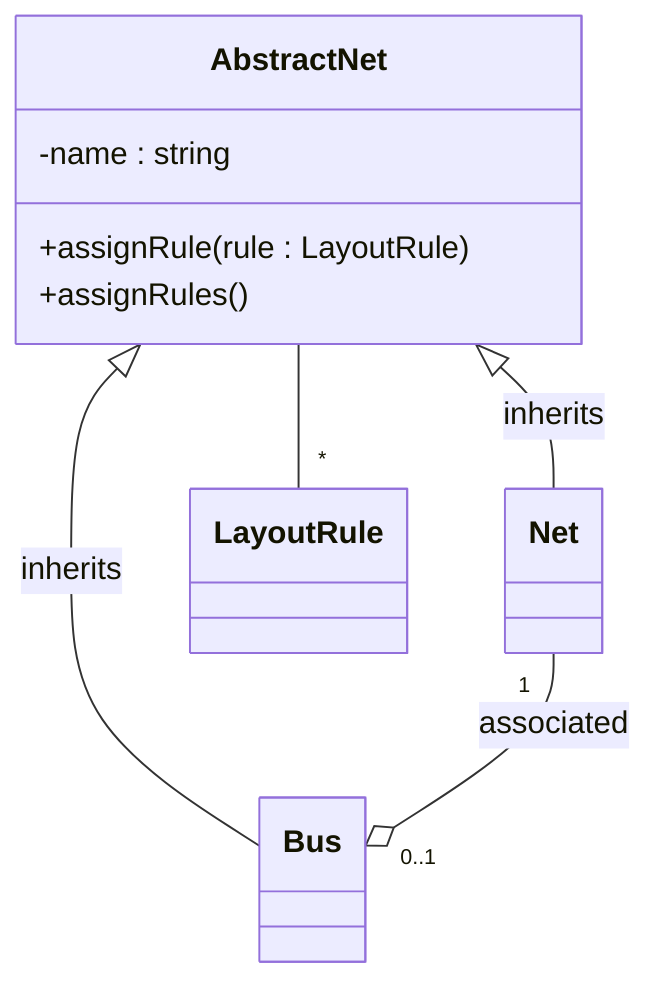

#### 모델과 코드의 대응. (분석모델 예시)
---

>[!warning]
>도메인 모델은 존재하지 않고, 기능만 차례로 구현하기 위해 코드를 작성하는 프로젝트는
>지식 탐구와 의사소통의 이점을 살리지 못함.
>도메인이 복잡해질 수록 그 한계가 드러남.

그렇다면 도메인 모델을 코드에 어떻게 녹일까? 🤔 (α)

#### 모델과 설계의 연결에서 분석모델을 활용 한다면?
---

>[!note]
> **분석 모델** : 소프트웨어적 수행 고려x, 도메인의 개념만을 체계화 하고자 업무 도메인을 분석한 결과물.

**모델과 설계의 연결** 을 <font color="#00ffcc">분석 모델로 진행하는 것은 비현실적</font>일 가능 성이 높고,
개발자가 설계를 하기위해 새로이 추상화를 할 때 분석 <font color="#00ffcc">모델에서의 지식의 탐구의 성과가 대부분 사라 진다</font>.

순수하게 이론에만 치우친 분석 모델은 도메인의 이해라는 가장 주된 목표에 미치지도 못하는데
중요한 발견은 <font color="#00ffcc">실제 설계/구현을 위해 노력</font>하는데에서 나타나기 때문.

결과적으로 순수하게 이론에만 치우친 분석 모델은 코딩이 시작되자마자 폐기되고 대부분의 문제를 다시 검토해야 한다.

>[!important]
>설계의 주된 부분이 도메인 모델과 대응되지 않으면 그 모델은 가치가 없으나,
>모델과 설계 사이의 복잡한 대응은 이해가 힘들고 실제로 설계가 변경되면 유지보수가 불가능해진다.

#### 분석과 설계를 연계를 안한다면? (In Model Driven Design)
---

분석과 설계 양쪽 모두의 목적을 달성하기 위 모델과 설계를 나누는 이분법은 채택하지 않음.
기술적인 쟁점은 배제.

설계상 각 객체는 모델에서 기술한 개념적 역할만 수행하며, 상이한 두 가지 목표를 달성해야 하기 때문에 모델에 부담이 커짐.

### 뭐 분석과 설계 둘 다 어렵고 연계도 어려운데 어쩌라는 건가 🤔
---

>[!important]
>모델 과 설계를 연계하는 것은 실용적임 (모델에 부담이 커지지 않으며 각자의 장점을 취할 수 있기 때문)
>근데 늘 그렇듯 잘 해야되는것.
>모델과 설계를 연계할 때 분석과 설계의 관점에서 모두 효과적인 모델이 필요함.

모델이 구현에 비해 비현실적이거나, 도메인의 핵심 개념을 충실하게 표현하지 않는다면 
새로운 모델을 찾자.

그래야 모델링과 설계 프로세스가 단 하나의 반복 고리를 형성할 수 있음.

뭐 대략 이상적인 반복고리? 
모든 팀 구성원이 UL을 사용하여 소통.



도메인 모델을 설계에 밀접하게 연관시키는 것을 강제하면, 각종 모델 가운데 유용한 것을 선택하는 또하나의 기준이 만들어지고 많은 반복주기와 리팩터링을 거쳐 관련성이 있는 모델이 만들어 진다.

1. 설계시 도메인 모델을 있는 그대로 반영.
2. 모델 꾸준히 재검토 및 수정
3. 분석과 설계를 충분히 만족하는 하나의 모델을 만들려는 노력

##### 아니 그럼 도대체 단하나의 반복고리가 아니면 뭘까? 🤔 (α)
---

위와 같은 연속된 과정이 제대로 이루어지지 않아, 여러 개의 분리된 또는 서로 동기화되지 않는 반복 고리들이 존재하는 상황 인것 같다.



각 과정은 자체적인 도메인 모델, 설계, 구현, 피드백 수집 및 모델 개선 과정을 거치지만, 독립적으로 작업을 진행하여 서로 간의 커뮤니케이션이 부족하고, 도메인 모델이 일관되게 개선되지 않으며 UL을 형성하지 않는 케이스 같음.

#### 실질적으로 모델을 코드에 어떻게 반영 할까? 🤔
---

>[!important]
>1. 모델로 부터 설계와 기본 적인 책임 할당에 사용한 용어를 도출.
>2. 코드 작성시 해당 용어를 사용하면서 코드가 모델을 표현.
>3. 코드의 변경이 곧 모델의 변경으로 이어질수 있도록.
>4. 코드~요구사항분석 개발 노력의 모든 측면에 오로지 하나의 모델만 적용되어야 함.
>  단일 모델은 오류가 일어날 확률을 줄이며 코드 자체도 모델의 전달력을 갖추게 됨.

4번의 경우 단 하나가 아닌 반복고리 케이스를 보면 알수 있듯.
독립적인 프로세스간의 모델 불일치가 가져오는 도메인에 대한 이해 및 소통의 저하.
코드간의 일관성 결여, 시스템 전체에서 통일된 접근 방식 결여, 코드 가독성 및 이해도 저하 등등등
코드가 모델의 전달력을 갖추기가 힘들게 된다!.

### 모델링 패러다임과 도구 지원
---

객체지향 예시.



객체는 실제로 메모리에 존재, 다른 객체와 연관관계를 맺으며 여러 클래스로 조직됨, 메시지 전달로 이용가능한 행위를 제공.

>[!important]
>많은 개발자가 단지 코드를 구성하는데 객체의 기술적 능력을 적용해 도움을 얻지만,
>객체 설계에서의 진정한 도약은 코드가 모델의 개념을 표현할 때 나온다.
>개념적 객체 모델과 직접적으로 유사한 객체와 관계를 만들어 낼 수 있다.
>2장에서 모델은 용어, 관계 (용어 - 객체 명)(관계 객체간 관계)

ex) Prolog

```prolog
% 부모-자녀 관계 정의
parent(alice, bob).   % Alice는 Bob의 부모입니다.
parent(bob, charlie). % Bob은 Charlie의 부모입니다.
parent(bob, dana).    % Bob은 Dana의 부모입니다.

% 남성과 여성 정의
male(bob).
male(charlie).
female(alice).
female(dana).

% 조부모 관계 정의
grandparent(GP, GC) :- 
    parent(GP, P),
    parent(P, GC).

% 할아버지 관계 정의
grandfather(GF, GC) :- 
    male(GF),
    grandparent(GF, GC).

% 할머니 관계 정의
grandmother(GM, GC) :- 
    female(GM),
    grandparent(GM, GC).

% 질의 예시
% ?- grandfather(X, charlie).
% ?- grandmother(X, dana).
```

Model Driven Design 에 잘 어울림.
패러다임은 논리이고 모델은 논리가 작용하는 일련의 규칙과 사실에 해당.


C언어의 경우 절차적인 언어에 대응되는 모델링 패러다임은 없기 때문에,
프로그래머가 도메인의 개념에 대해 생각할 순 있어도 프로그램 자체는 데이터를 기술적으로 조작하는 것에 지나지 않음

```cpp
#include <stdio.h>
#define MAX_STUDENTS 100
#define MAX_GRADES 10

typedef struct {
    char name[50];
    char department[50];
    int grades[MAX_GRADES];
    int grade_count;
} Student;

Student students[MAX_STUDENTS];
int student_count = 0;

void add_student(const char *name, const char *department) {
    Student s;
    strcpy(s.name, name);
    strcpy(s.department, department);
    s.grade_count = 0;
    students[student_count++] = s;
}

void add_grade(const char *name, int grade) {
    for (int i = 0; i < student_count; i++) {
        if (strcmp(students[i].name, name) == 0) {
            students[i].grades[students[i].grade_count++] = grade;
            break;
        }
    }
}

int highest_grade(const char *department) {
    int max = 0;
    for (int i = 0; i < student_count; i++) {
        if (strcmp(students[i].department, department) == 0) {
            for (int j = 0; j < students[i].grade_count; j++) {
                if (students[i].grades[j] > max) {
                    max = students[i].grades[j];
                }
            }
        }
    }
    return max;
}

int main() {
    add_student("John", "Computer Science");
    add_student("Mary", "Biology");
    add_student("Alex", "Mathematics");
    add_grade("John", 85);
    add_grade("John", 90);
    add_grade("Mary", 88);
    add_grade("Alex", 92);

    printf("Highest grade in Computer Science: %d\n", highest_grade("Computer Science"));
    return 0;
}

```

프로그램은 의미를 많이 담지 못함. (특히나 수학적이지 않은 도메인의 경우, 절차상의 단계로 개념화 되지 않기 때문.)

자료형은??? 🤔
조직화 된 데이터일 뿐 도메인의 활동적인 측면을 담기 힘듬.
결국 예상된 실행 경로를 토대로 상호 연결된 복잡한 기능만 갖게됨.

### 자 그럼 절차적인 방식에서 모델 주도적인 방식으로 전환해보자.
---


4개의 네트들을 xyz의 버스에 속하는 네 개의 비트를 구성.

4개가 아니라 8개 16 개 256개 네트를 하나의 버스로 묶어 생산성 향상, 관리가능 규모로 나누기 가능.

##### 기계적 설계

각 회로 연결

| 네트 이름 | 컴포넌트.핀 |
|-----------|--------------|
| Xyz0      | A.0, B.0     |
| Xyz1      | A.1, B.1     |
| Xyz2      | A.2, B.2     |

레이아웃 규칙

| 네트 이름 | 규칙 유형       | 매개변수 |
|-----------|-----------------|----------|
| Xyz1      | min_linewidth   | 5        |
| Xyz1      | max_delay       | 15       |
| Xyz2      | min_linewidth   | 5        |
| Xyz2      | max_delay       | 15       |



입력된 규칙

| 버스 이름 | 규칙 유형 | 매개변수 |
|-----------|-----------|----------|
| Xyz       | max_vias  | 3        |

파일에 아래와 같은 네트 규칙 추가됨.

| 네트 이름 | 규칙 유형    | 매개변수 |
| ----- | -------- | ---- |
| Xyz0  | max_vias | 3    |
| Xyz1  | max_vias | 3    |
| Xyz2  | max_vias | 3    |


스크립트가 하는 일은 단순히 파일을 조작하는 것에 불과
파일형식이 다르면 버스를 그룹화 하고 버스에 규칙을 적용하는 개념은 동일해도 처음부터 다시 해야 함.

> 도메인 모델을 버스 라는 개념으로 보충 하는것.

#### 모델 주도 설계




```java
abstract class AbstractNet {

	private Set rules;

	void assignRule(LayoutRule rule) {
	
		rules.add(rule);
	
	}

	Set assignedRules() {
	
		return rules;
	}
}

class Net extends AbstractNet {

	private Bus bus;

	Set assignedRules() {

		Set result = new HashSet();

		result.addAll(super.assignedRules());

		result.addAll(bus.assignedRules());

		return result;

	}

}
```


서비스로 캡슐화 할 가져오기/내보내기 로직

| 서비스        | 설명                                   |
| ---------- | ------------------------------------ |
| 네트 목록 가져오기 | 네트 목록 파일을 읽고 각 항목에 대한 인스턴스를 생성한다.    |
| 네트 규칙 내보내기 | 특정 네트 집합에 대해 첨부된 모든 규칙을 규칙 파일에 기록한다. |

 유틸리티.

| 클래스             | 책임                                                         |
|--------------------|--------------------------------------------------------------|
| NetRepository      | 이름을 기준으로 네트에 접근하게 해준다.                       |
| InferredBusFactory | 특정 네트 집합에 대해 명명규칙을 이용해 버스를 추론하고 인스턴스를 생성한다. |
| BusRepository      | 이름을 기준으로 버스에 접근하게 해준다.                       |

가져온 데이터로 레포지토리를 초기화 하기만 하면됨.

```java
Collection nets = NetListlmportService.read(aFile);
NetRepository.addAll(nets)
Collection buses = InferredBusFactory.groupIntoBuses(nets);
BusRepository.addAll(buses);
```

#### 테스트 코드

```java
public void testBusRuleAssignment() {

Net aO = new Net("aO");
Net al = new Net("al");
Bus a = new Bus("a"); // 버스가 이름을 토대로 인식하는 것에
a.addNet(aO);  //개념적으로 의존하지 않으므로
a.addNet(al);  //버스의 테스트도 그래서는 안 된다.

NetRule minWidth4 = NetRule.create(MIN_WIDTH, 4);
a.assignRule(minWidth4);

assertTrue(aO.assignedRules().contains(minWidth4));
assertEquals(minWidth4, aO.getRule(MIN_WIDTH));
assertEquals(minWidth4, al.getR나le(MIN_WIDTH));

}
```

각 서비스와 레포지토리 는 테스트가 가능하며 핵심 도메인 로직을 테스트 할 수 있음.

>[!important]
>연산인 하나만 있는 경우 스크립트 기반 접근법이 좋을 수도 있으나.
>Model-Driven-Design은 쉽게 규모를 확장할 수 있고 규칙, 개선사항을 결합하는 것과 관련된 제약조건을 포함할 수 있음.
>테스트 하기도 쉬움.(스크립트 테스트는 처음부터 끝까지 파일 입출력 비교해야함.)

### 내부 드러내기
---

사용자는 즐겨찾기를 세션간에 지속되는 웹사이트 이름 목록이라고 생각함.

ms 인터넷 익스플로러 즐겨찾기에서는 즐겨찾기를 URL이 저장된 파일로 간주하고 해당 파일의 이름을 즐겨찾기 목록에 넣음.

즉 윈도우 파일명으로 쓸 수 없는 문자가 포함되어 있으면 문제가 발생.

ex) 안녕 : 하위
: 로 인해서 오류 발생.

웹 페이지 제목 역시 파일명으로 쓸 수 없는 문자가 포함 되어 있으면 익스플로러에서 문자를 알아서 제거.


사용자가 기대하는 바가 아님.
<font color="#00ffcc">사용자 모델과, 설계/구현 모델이 별도로 존재한다는 문제점.</font>

해결방안

1. 단순히 단축 아이콘 파일을 모아놓은 것에 불과하다면 이 사실을 사용자에게 드러내어 기능혼동을 줄이고 사용자를 오도하는 번외 모델을 제거.
2. 데이터 파일과 다른 방식으로 저장해서 명명 규칙을 따르게 하여 단일 모델을 제공한다.

### 실천적 모델러
---

>고도로 숙련된 엔지니어는 설계를, 숙련된 노동자는 제품을 조립.

위 은유는 소프트웨어 개발은 모든 것이 설계다 라는 단순한 이유로 많은 프로젝트를 엉망으로 만들었다.

>[!note]
>분석, 모델링, 설계, 프로그래밍에 대한 책임을 지나치게 구분하는 것은 Model-Driven-Design과 상충한다.
>
>1. 모델의 의도중 일부과 이관 되는 경우 개발자가 활용하기가 쉽지 않다.
>2. 모델의 구현과 기술과의 상호작용에 대한 피드백이 간접적이다.
>   모델의 특정 측면이 특정 플랫폼 내에서 비효율적이더라도 파악하기가 쉽지 않다.
>
>코드를 작성하는 사람이 모델에 책임을 느끼지 못하거나 애플리케이션을 대상으로 모델이 동작하게 만드는 법을 모른다면 모델은 소프트웨어와 무관해지며, 리팩터링은 모델을 약화 시킬것이다.
>반면에
>모델러가 구현 프로세스와 분리되 어 있다면 제약 조건을 감안하는 능력을 갖추지 못하거나 잃어버릴 것이다. 
>모델이 효과적인 구현을 뒷받침하고 핵심도메인 지식을 추상화한다는 제약조건은 절반쯤 사라짐.
>
>결국 코드로 만드는 과정의 미묘한 사항들은 협업을 통해서 알 수 있음.


>[!important]
>전문화된 역할을 맡을 수 없다는 의미가 아니라.
>모델링과 구현이라는 두 가지 과업을 분리하는게 문제의 시작 이라는 것.
>코드를 변경하는것은 곧 모델을 변경하는 것이며 프로그래머가 곧 모델러다.
>그러므로
>1. 모든 기술자는 코드를 접하는데 시간을 투자해야 한다.
>2. 코드를 변경하는 책임이 있는 모든 이는 코드를 통해 모델을 표현하는 법을 배워야 한다.
>3. 개발자는 모델에 관한 토의에 깊이 관여해야 하고 도메인 전문가와도 접촉 해야 한다.


도메인 주도 설계는 모델을 동작하게 만들어 애플리케이션의 문제를 해결한다.
모델과 구현을 매우 밀접하게 연결하며 UL은 개발자와 도메인 전문가, 소프트웨어 사이에 흐르는 모든 정보의 통로에 해당한다.
그결과는 핵심 도메인의 근본적인 이해를 토대로한 기능이 풍부한 소프트웨어.

