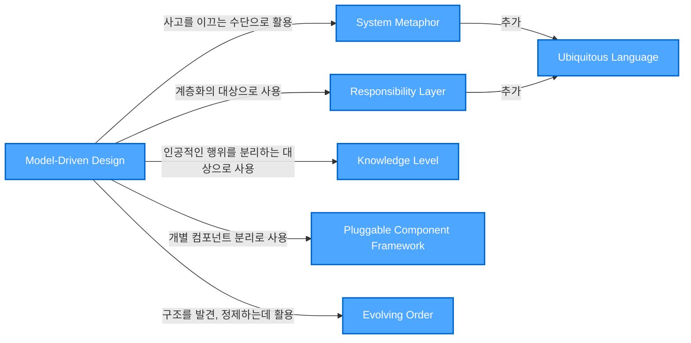

```mermaid
graph LR
    MDD[Model-Driven Design]
    SM[System Metaphor]
    RL[Responsibility Layer]
    KL[Knowledge Level]
    PCF[Pluggable Component Framework]
    EO[Evolving Order]
    UL[Ubiquitous Language]

    MDD -->|사고를 이끄는 수단으로 활용| SM
    MDD -->|계층화의 대상으로 사용| RL
    MDD -->|인공적인 행위를 분리하는 대상으로 사용| KL
    MDD -->|개별 컴포넌트 분리로 사용| PCF
    MDD -->|구조를 발견, 정제하는데 활용| EO
    
    SM -->|추가| UL
    RL -->|추가| UL

    classDef default fill:#e6f3ff,stroke:#333,stroke-width:2px;
    classDef concept fill:#4da6ff,stroke:#0066cc,stroke-width:2px,color:#fff;
    
    class MDD,SM,RL,KL,PCF,EO,UL concept;
```