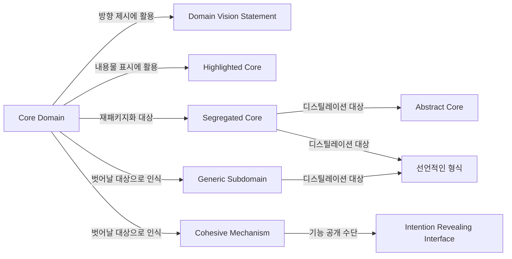

```mermaid
graph LR
    A[Core Domain]
    B[Domain Vision Statement]
    C[Highlighted Core]
    D[Segregated Core]
    E[Generic Subdomain]
    F[Cohesive Mechanism]
    G[Abstract Core]
    H[선언적인 형식]
    I[Intention Revealing Interface]

    A -->|방향 제시에 활용| B
    A -->|내용물 표시에 활용| C
    A -->|재패키지화 대상| D
    A -->|벗어날 대상으로 인식| E
    A -->|벗어날 대상으로 인식| F
    D -->|디스틸레이션 대상| G
    D -->|디스틸레이션 대상| H
    E -->|디스틸레이션 대상| H
    F -->|기능 공개 수단| I
```
