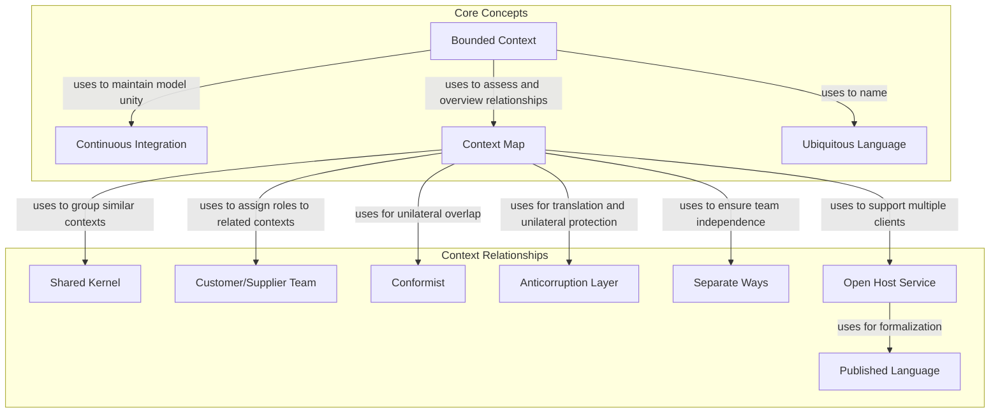

>다른 여러 모델 간의 경계와 관계를 표시해줄 수단이 필요하다.\
>의식적으로 전략을 결정해야 하며, 그리고 나서 이러한 전략을 지속적으로 따라야 한다.\
>모델과 다른 모델과의 관계가 지닌 한계를 인식하고 전달하며, 선택하는 기법을 설명한다.

복잡한 시스템에서 여러 모델이 공존할 때 발생하는 도전과 제약을 의미하는 것 같다.\

1. 서로 다른 모델은 같은 개념에 대해 다른 정의나 해석을 가질 수 있으며 모델간 통합시 오해와 불일치를 가질 수 있다.
2. 조직 구조가 모델 간의 통합을 방해할 수 있다.
3. 모델간의 진화 속도의 차이가 지속적인 동기화가 어렵게 만들 수 있다.
4. 컨텍스트가 다를 수 있다.

등등 모델과 다른 모델과의 관계가 지닌 한계들이 존재할 수 있다고 이해 해 보았다.

---

그 기법은 현 프로젝트 분야를 매핑하는 것에서부터 출발한다.

Context Map이 프로젝트 컨텍스트와 각 컨텍스트 간의 관계의 전체적인 개관을 제공해주는 한편.

Bounded Context는 각 모델의 적용가능성의 범위를 정의한다.

모호함이 줄어드는것 자체가 프로젝트의 진행 방식은 바꾸겠지만 이것만으로는 충분하지 않다.

일단 컨텍스트가 제한되면 (Context Bounded) Continuous Integration 즉 지속적인 Integration 프로세스를 토대로 모델의 단일화를 유지할 수 있을 것이다.\
그러면 이처럼 안정적인 상황에서 시작해서 Bounded Context와 Shared Kernel과 밀접하게 관련된 컨텍스트에서 Separate ways를 취하는 느슨하게 결합된 모델이 이르는 각 BoundedContext를 연결하기위 한 더욱 효과적인 전략으로 나갈 수 있다.

